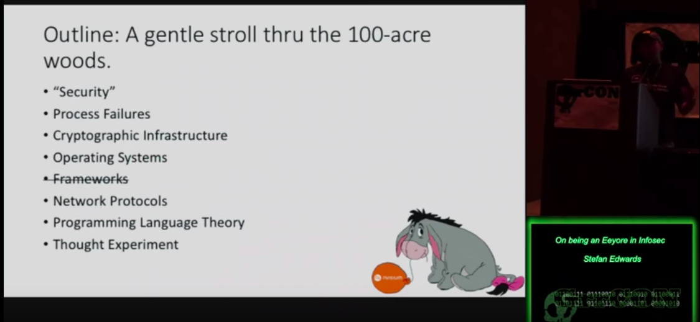
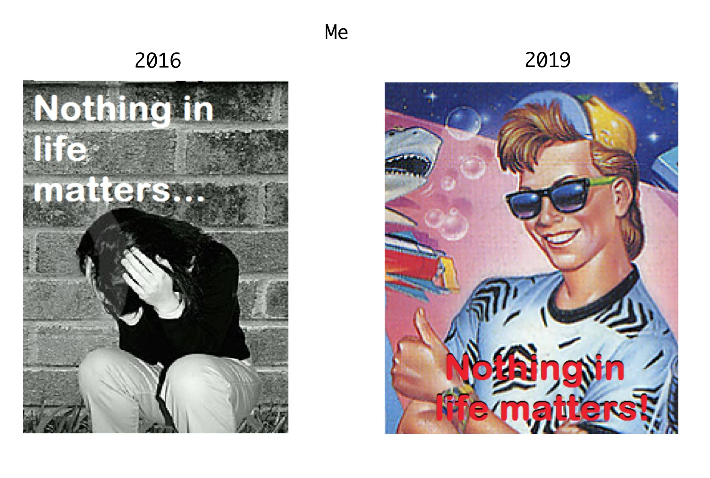
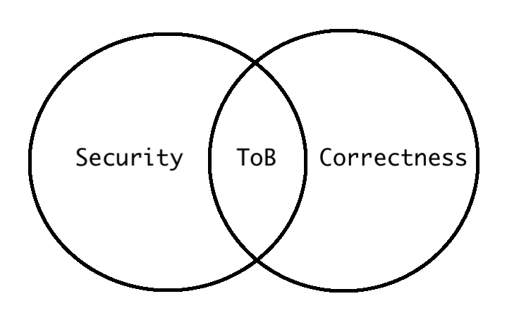
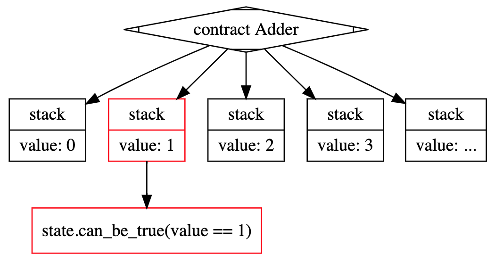
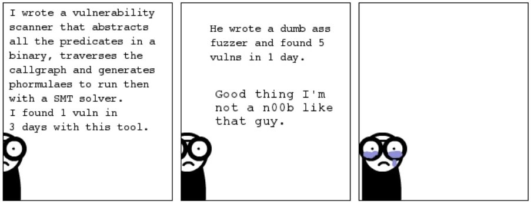

# Return to the Hundred Acre Woods
### what I've learnt in 3 years
### _or_
### 3eeyore5u

---

# `$ finger lojikil`

```
[lojikil.com]
Stefan Edwards (lojikil) is not presently logged in.

- Assurance Practice Lead, Trail of Bits
- Twitter/GitHub/Lobste.rs: lojikil
- Works in: Defense, FinTech, Blockchain, IoT, compilers,
vCISO services
- Previous: net, web, adversary sim, &c.
- Infosec philosopher, professional programming
language theorist, everyday agronomer, father.

WARNING: DEAF
WARNING: Noo Yawk
```

---

# in 2016 I gave this talk


<!--
probably one of my favorite talks ever;

Covered nihilism, security, everything that I saw as wrong in the IT/IS

page_number: true
footer: Return to the Hundred Acre Woods :: lojikil
-->

---

# this talk

- cover what I've seen going from traditional infosec to high(er) assurance work
- talk about application of formal techniques & cryptography
- why none of this will save you, I'm still Eeyore


 `=>` 

---

<!--

talk about the areas I had covered previously, and lay out why they 
are still issues now
-->

# take aways

## no golden roads to security

1. TINSTAAFL: formal tools & cryptography aren't panaceas 
2. There is no golden road to ~~arithmetic~~ security
3. Formally proven code fails, fancy crypto breaks

---

# me: 2016 vs 2019

## 2016
- OSINT, threat modeling, blackbox, web, net, lots of gov, finance

## 2019
- those + formalisms, PLT, more exposure to fancy crypto

---



<!-- as you can see, a lot has changed, even if not everything
has changed.

Life has more color now... even if it's meaningless...
-->

---

# when I said "security, I meant...

- design +
- denotation +
- formalized & verified model +
- centralized security controls +
- decentralized implementation ==
- "secure"

<!--

when I said "security" previously, I really did mean this...

-->
---

# now when I say security...

- Not much has changed



<!--

Now I'm actually working in the space that I had previously spoken about

There are many things outside the realm of what we do, both for security and correctness,
but we work in the intersection of the two, and it's quite nice

-->

---

# let's update ourselves


<!--

So given that I now work at a place that specializes in this sort of correctness, things
are... better... right?

Also, I love writing these notes to myself, because I know I will ignore them and
likely no one else will read them. It's the coup de grace of notes really

-->

---

# formal tools won't save you

2016

- Java: Java Modeling Language (JML)
- C: Frama-C
- [fancy formal languages no one uses] : [fancy formal tools no one uses]
  - Eiffel, Sather, Lissac, any other DBC language there
  - TLA+, ACL2, &c were also alive
  - Ada has been around since forever

<!-- these were the sorts of tools I was seeing & partially using in 2016... -->

---

# formal tools won't save you

- tools were verbose
- often unused, difficult to use, or unknown

<!-- seriously, how many people *know* what JML is? -->

---

# a formal aside

- JML is > 20 years old (first specs & such from 1999)
- multiple compiler support it
- industry standard...
- "just" Hoare logic
- ... with large, longitudinal case studies...
- ... virtually unused

---

# formal in 2019

- regularly interact with formal tooling
- since joining ToB, have written two, one for a client
- ease of use has gotten better
  - in Ethereum, there are *many* to chose from
- tend to lean towards ease of use vs specificity
  - lots of verifiers, less specifiers
  - more built in tests

<!--

- maybe talk about specification vs verification
- talk about the types of things we see tested...
- how tests are starting to work...

-->

---
# formal in 2019

```python
contract_src="""
contract Adder {
    function incremented(uint value) public
    returns (uint){
        if (value == 1)
            revert();
        return value + 1;
    }
}
"""
# ...
value = m.make_symbolic_value()

contract_account.incremented(value)
# ...
for state in m.ready_states:
    print("can value be 1? {}".format(
        state.can_be_true(value == 1)))
```

<!--

- so here we have a simple example of a reduced Manticore script
- Manticore will generate all states within a program
- THIS IS SUPER ACCESSIBLE! basically anyone with python experience can do this
-->

---

# formal in 2019



<!--

- diagram of paths
- talk about state explosion
- size of analysis vs path explosion
- average size of contracts

-->
---

# formal in 2019

- pros:
  - much easier to start now
  - multiple implementations, geared towards devs, CI/CD
- cons:
  - the usual negatives
- as we'll see: formally proven/verified code *can* fail 

<!--

- symbex & other formal techniques have trade offs
- 

-->

---

# fuzzing won't save you


<!--

so very often when we see symbex as a problem, we turn to fuzzing...

-->

---

# fuzzing contra symbex


_from http://deniable.org/reversing/symbolic-execution_

---

# fuzzing in 2016

- SecLists
- Radamsa
- AFL
- some exotic stuff like DART

_https://patricegodefroid.github.io/public_psfiles/talk-pldi2005.pdf_

---

# fuzzing in 2019

- those, plus
- easily accessible grammar fuzzers
  - Mozilla Dharma, various others
- grey-box fuzzers
  - ECLIPSER
- other combinations of symbex + fuzzing
  - concretize via fuzzing
  - negate paths ala SAGE
- property-based testing

---

# fuzzing in 2019

<!--

keeping with how I'm showing our tools, let's look at PBTs

-->

```
contract TEST is NewCoin {
  uint private initSupply;
  address private alice = ...;
  address private bob = ...;
  address private eve = ...;

  constructor() public {
    balances[alice] = 10000;
    balances[bob] = 10000;
    balances[eve] = 10000;
    initSupply = totalSupply_;
  }
  // the actual good stuff:
  function echidna_test() public returns (bool) {
    totalSupply_ = balances[alice] + balances[bob] + 
    balances[eve];
    return (initSupply == totalSupply_);
  }
}
```


---

# fancy crypto won't save you

---

# even if you get those things right, you don't win

<!--

talk about

- breaks in formally proven code, due to either missing the correct formalisms, or w/e
- talk about misapplications of crypto vis-a-vis implementation complexity, incorrect application, &c.

-->

